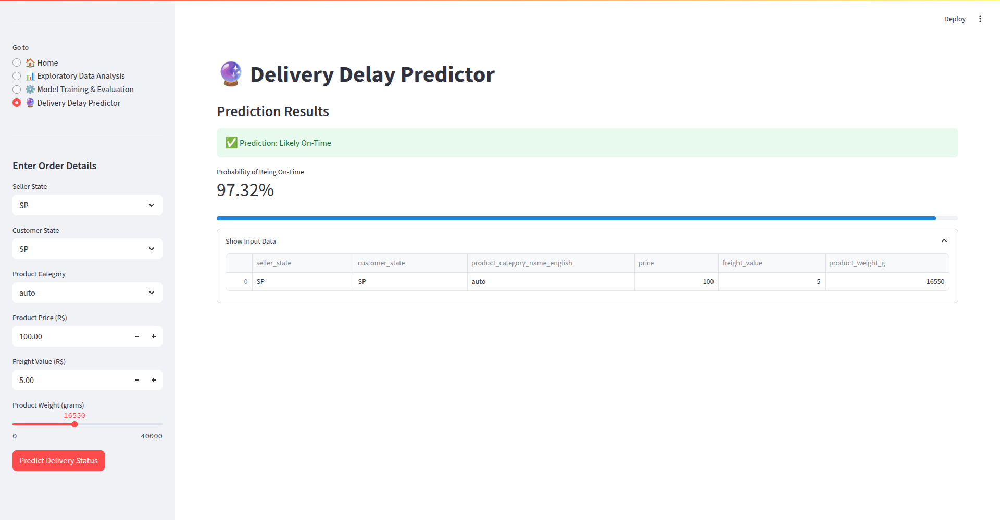

# Olist E-commerce Logistics Analytics Dashboard

This repository contains an end-to-end data project using the Olist Brazilian E-commerce dataset. The project is an interactive Streamlit application aimed at a Logistics Audience, focusing on data exploration, delivery performance analysis, and machine learning-powered delay prediction.

## Project Structure

```
olist-logistics-app/
├── dataset/              # Place all Olist *.csv files here
│   └── *.csv
├── docs/
│   └── project_details.md  # Explanations of non-ML parts
├── img/                  # Folder for UI screenshots
│   ├── eda_page.png
│   └── prediction_page.png
├── src/
│   ├── data_processing.py  # Module for data loading and prep
│   └── model_training.py   # Module for model training
├── app.py                # The main Streamlit application
└── requirements.txt      # Python dependencies
```

## Application Preview

### Home Page


### Model Training Page


### Delivery Delay Predictor Page


## 🚀 How to Run the Application

1. **Clone the Repository**:
   ```bash
   git clone <your-repo-url>
   cd olist-logistics-app
   ```

2. **Set up the Environment**:
   Create a virtual environment and install the required packages.
   ```bash
   python -m venv venv
   source venv/bin/activate  # On Windows, use `venv\Scripts\activate`
   pip install -r requirements.txt
   ```

3. **Add Data**:
   Place all the Olist CSV files into the `dataset/` folder.

4. **Run Streamlit**:
   Execute the following command from the root directory (`olist-logistics-app/`).
   ```bash
   streamlit run app.py
   ```

   The application should now be open in your web browser.

## Project Documentation

- **Machine Learning**: The model development process is detailed in the document you are currently viewing on the right.
- **Other Components**: For detailed information on the Business Context, Power BI Storyboard, and Data Architecture, please see the `project_details.md` file in the `docs/` folder of this repository.