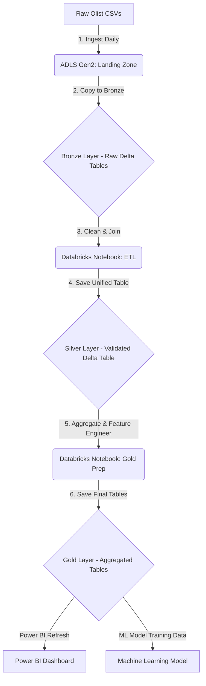

## Project Details: Business Context & Data Architecture

### 1. Business Context & Audience

**Company**: Olist (A Brazilian E-commerce Marketplace)  
**Audience**: Logistics Department (Head of Logistics, Regional Managers)  
**Problem**: In a competitive e-commerce market, delivery time and reliability are key drivers of customer satisfaction. Delays lead to poor reviews, increased customer service costs, and potential churn. The logistics team needs tools to monitor performance and proactively mitigate risks.

**Key Business Questions**:
- What is our overall on-time delivery (OTD) performance?
- Which geographical regions (seller or customer states) are bottlenecks in our network?
- Are certain product categories more prone to shipping delays?
- Can we predict if a new order will be late at the time of purchase?

### 2. Power BI Storyboard

A Power BI report would be designed as a guided narrative to help the logistics team make data-driven decisions.

#### Page 1: Logistics KPI Cockpit
**Goal**: Provide a high-level, real-time view of the network's health.  
**Visuals**:
- **KPI Cards**: On-Time Delivery % (OTD), Average Delivery Days, Average Delay (for late orders), Total Freight Cost.
- **Map**: A filled map of Brazil showing the number of late orders by customer state. This immediately highlights problem regions.
- **Time Series Chart**: A line chart showing the trend of OTD % over the last 12 months, allowing managers to see if performance is improving or declining.

#### Page 2: Delay Root Cause Analysis
**Goal**: Drill down into the "why" behind the delays.  
**Visuals**:
- **Bar Chart**: Late Orders by Seller State. This helps identify if delays originate from specific fulfillment locations.
- **Treemap**: Late Orders by Product Category. This can show if bulky, fragile, or specific types of items are causing issues.
- **Scatter Plot**: `freight_value` vs. `delivery_duration_days`. Helps answer: "Does paying more for shipping actually make it faster?"
- **Filters**: Slicers for Year, Quarter, and State to allow for interactive exploration.

### 3. Databricks Data Transformation

Before data can be used for analytics or ML, it needs to be transformed in a scalable environment like Databricks.

- **Data Ingestion**: All raw CSV files from the Olist dataset are loaded as Spark DataFrames.
- **Joins**: A series of joins are performed to create a single, wide fact table, linking orders with customers, products, sellers, and order_items.
- **Feature Engineering**: New columns critical for logistics analysis are created:
  - `delivery_duration_days`: The total time from purchase to delivery.
  - `processing_time_days`: The time it takes for a seller to hand the order to the carrier.
  - `is_late`: A binary flag (1/0) that serves as the target variable for our ML model.

### 4. Batch Ingestion Pipeline (Medallion Architecture)

A robust, automated pipeline is crucial for keeping the analytics fresh and reliable. The Medallion Architecture is a best practice for structuring data in a data lake.

**Tools**:
- **Orchestration**: Azure Data Factory or Apache Airflow
- **Storage**: Azure Data Lake Storage (ADLS) Gen2 or AWS S3
- **Processing**: Databricks (using PySpark)

#### Architecture Diagram

#### Pipeline Steps
- **Bronze Layer**: Raw data is ingested from the source and stored in its original, untouched format. This provides a historical archive and enables reprocessing.
- **Silver Layer**: Data from the Bronze layer is cleaned, validated, de-duplicated, and joined into a unified fact table. This layer represents a single source of truth.
- **Gold Layer**: Data from the Silver layer is aggregated and transformed to create business-specific, performant tables (views) that are optimized for analytics. The Power BI dashboard and ML model would both be powered by data from this Gold layer.